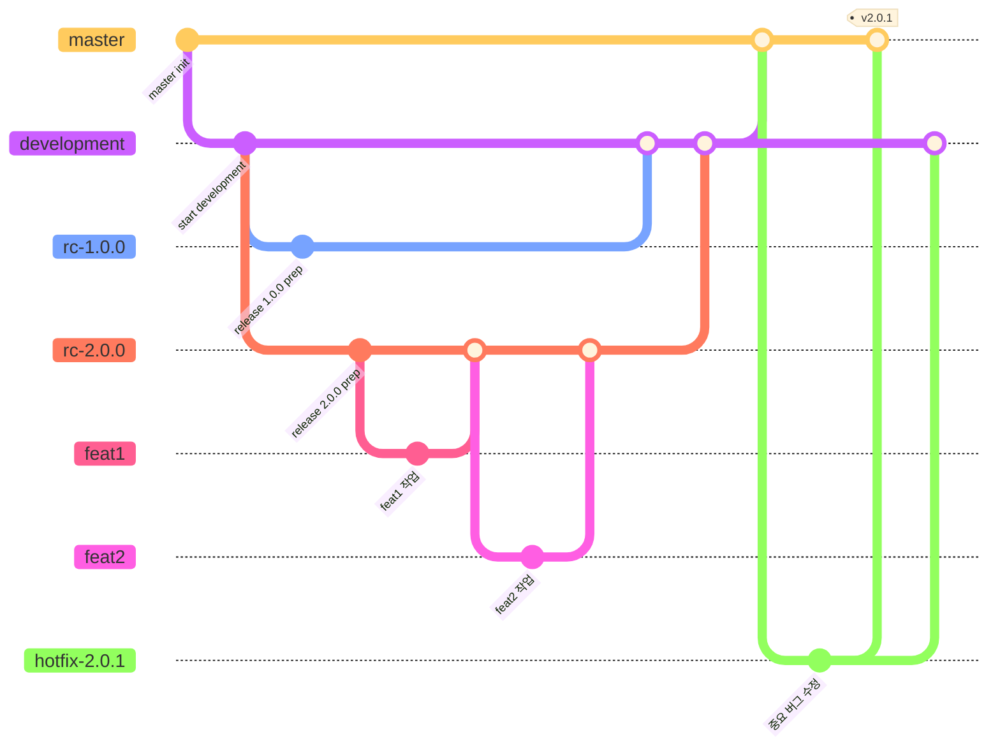

# 🐴 달릴까말까

가벼운 내기, 예측 불가 레이스! '달릴까말까' 지금 시작해보세요!  

<br>  

### ✏️ 간단한 프로젝트 소개

> ‘달릴까말까’는 말 캐릭터들이 출발선에서 결승선까지 달리며 순위를 정하는 복불복 게임이에요.  
> 말들이 느려졌다 빨라졌다, 갑자기 뒤로 가기도 하며 예측할 수 없는 레이스를 펼쳐요.  
> 중간중간 속도 변화와 반전이 있어 끝까지 긴장감을 놓을 수 없죠.  
> 또한, 세로와 가로 모드를 모두 지원해 어느 방향으로도 편리하게 즐길 수 있어요.  
> 커피 내기, 점심 메뉴 정하기처럼 가벼운 결정이 필요할 땐 ‘달릴까말까’로 재미있고 빠르게 정해보세요!

<br>

### 🔗 스토어 링크  

- [App Store](https://apps.apple.com/kr/app/%EB%8B%AC%EB%A6%B4%EA%B9%8C%EB%A7%90%EA%B9%8C/id6747607216)  
- [Play Store](https://play.google.com/store/apps/details?id=com.appisode.run_or_not)  

<br> 

### 🛠️ 앱 개발에 사용한 기술 및 환경

```
- 프레임워크 & 언어
    - Flutter
    - Dart  
- 개발 환경
    - Xcode
    - Android Studio
- 개발 도구 & 협업 툴  
    - Git
    - Github
    - Figma
    - Notion
- 사용 기술
    - MVI Pattern
    - Clean Architecture
    - DI
- 외부 패키지
    - provider(v6.1.5)
    - go_router(v15.1.2)
    - get_it(v8.0.3)
    - rive(v0.13.14)
```

<br>

### 🧑🏻‍💻 팀원

- [Jumy's Github](https://github.com/kdjun97)
- [Ujun's Github](https://github.com/MentalJava)

<br>

### 🌴 Git Flow


